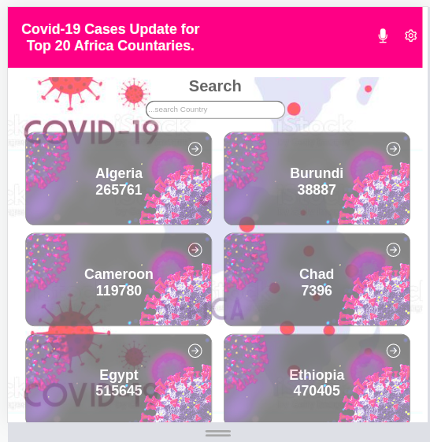

# Project Name
React Capstone Project - COVID-19 Metrics Webapp

This is a simple metric web-app for tracking of Covid-19 cases in Africa. Using the top 20 african countries as a case study.

## Live Demo (if available)

[Live Demo Link](https://livedemo.com)

## Loom Video Presentation

[Loom Video Link](https://www.loom.com/share/238c1de69db44231ad5919212f2a118c)

## Built With

- HTML5
- CSS3
- JavaScript
- React (CRA)
- Redux

## Live Demo (if available)

To get a local copy up and running follow these simple example steps.

### Prerequisites

Node.js
npm

### 1. `npm install`

Install all the dependencies needed for the project to work correctly.

### 2. `npm start`

Runs the app in the development mode.\
Open [http://localhost:3000](http://localhost:3000) to view it in your browser.

The page will reload when you make changes.\
You may also see any lint errors in the console.

### Run tests
### `npm test`

Launches the test runner in the interactive watch mode.

### Deployment
### `npm run build`

Builds the app for production to the `build` folder.\
It correctly bundles React in production mode and optimizes the build for the best performance.

The build is minified and the filenames include the hashes.\
This makes the app ready to be deployed!

## Authors

👤 **Eneh Charles Chukwunweike**

- GitHub: [@charlyeneh](https://github.com/charlyeneh)
- Twitter: [@twitterhandle](https://twitter.com/ProgrammerBaby)
- LinkedIn: [LinkedIn](https://www.linkedin.com/in/charles-chukwunweike-eneh/)

## 🤝 Contributing

## Show your support

Give a ⭐️ if you like this project!

## Acknowledgments 🤝

- Microverse Curriculum

## 📝 License

This project is [MIT](./MIT.md) licensed.
